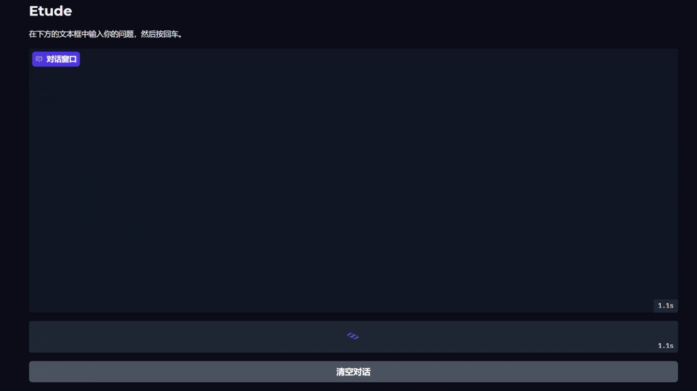

# Etude LLMv0.2

## 项目简介

Etude LLM是一个轻量级的语言模型实现项目，旨在提供一个可定制、可扩展的语言模型架构。该项目采用模块化设计，支持标准Transformer结构。项目名称"Etude"（练习曲）寓意该项目既是语言模型实现的学习实践，也可作为更复杂模型架构的基础。





## 项目结构

```
Etude LLM/
├── inference/              # 模型推理代码
│   ├── __init__.py
│   ├── inference.py        # 基础推理实现
│   └── inference_laRA.py   # LoRA推理实现
├── model/                  # 模型定义
│   ├── __init__.py
│   ├── model.py            # 基础模型架构
│   └── model_loRA.py       # LoRA模型架构
├── tool/                   # 数据处理工具
│   ├── cut_json.py         # JSON数据处理
│   ├── cut_jsonl.py        # JSONL数据处理
│   ├── cut_jsonl_sft.py    # SFT数据格式处理
│   ├── cut_txt.py          # 文本切分工具
│   └── extract_xml.py      # XML数据提取工具
├── train/                  # 训练相关代码
│   ├── __init__.py
│   ├── config.py           # 训练配置
│   ├── data_utils.py       # 数据工具函数
│   ├── train_pretrain.py   # 预训练实现
│   ├── train_sft.py        # SFT训练实现
│   └── train_tokenizer.py  # 训练分词器
├── img/                    # 图片资源
│   └── Etude.gif
├── training_data/          # 训练数据（被.gitignore排除）
└── weight/                 # 模型权重（被.gitignore排除）
```

## 核心功能

### 模型架构

Etude LLM实现了以下核心组件：

1. **注意力机制**：
   - 多头注意力(MultiHeadAttention)

2. **Transformer块**：
   - 标准前馈网络(FeedForward)


### 数据处理

项目提供多种数据处理工具：

- **XML处理**：从维基百科等XML格式数据中提取和清洗文本
- **文本切分**：将大型文本文件切分为训练样本
- **JSONL处理**：处理JSON格式的训练数据

### 训练方法

支持多种训练范式：

- **预训练(Pretraining)**：基础语言模型训练
- **监督微调(SFT)**：指令微调训练
- **分词器训练**：自定义分词器训练

## 快速开始

### 训练流程概述

Etude LLM的训练流程分为三个主要步骤：

1. **分词器训练** - 创建自定义分词器
2. **预训练** - 基础语言模型训练
3. **监督微调(SFT)** - 指令微调训练

### 详细训练步骤

#### 1. 分词器训练

首先训练自定义分词器：

```bash
cd train
python train_tokenizer.py all
```

这将：
- 验证配置文件
- 训练BPE分词器
- 创建Hugging Face兼容的分词器配置
- 验证分词器功能

#### 2. 预训练

进行基础语言模型预训练：

```bash
cd train
python train_pretrain.py
```

配置参数（可在`config.py`中调整）：
- 批量大小：16
- 学习率：3e-4
- 训练轮数：3
- 设备：自动检测CUDA/CPU

#### 3. 监督微调(SFT)

在预训练模型基础上进行指令微调：

```bash
cd train
python train_sft.py
```

配置参数：
- 批量大小：8
- 学习率：3e-5
- 训练轮数：3

### 数据准备
训练数据应放置在以下目录：

示例：

- 预训练数据：`training_data/pretrain/pretrain_hq.jsonl`
- SFT数据：`training_data/sft/sft_mini_512.jsonl`

### 模型保存

训练完成后，模型将保存在：
- 预训练模型：`weight/etude_pretrained_model/`
- SFT模型：`weight/etude_sft_model/`
- 分词器：`weight/tokenizer/`

### 恢复训练

所有训练脚本支持断点续训：
- 自动检测检查点文件
- 恢复优化器状态和训练进度
- 支持从预训练模型继续SFT训练

## 技术特点

1. **模块化设计**：各组件高度解耦，便于扩展和实验
2. **灵活配置**：通过`EtudeConfig`类提供统一的配置接口


## 使用场景

- 语言模型研究与实验
- 文本生成应用
- 自然语言处理任务
- 作为更复杂模型开发的起点

## 未来发展

- 支持更多模型架构变体
- 扩展到多模态任务
- 优化推理速度
- 重构代码

## 总结

- 相比之前的复刻gpt2，这个要好很多，但仍然极其稀烂，未来我将会重构代码。
- 虽然这个版本已经可以跑起来，但是很垃圾，训练速度极其慢。
- 原来那个v0.1压根没法正常对话，所以我没保留


